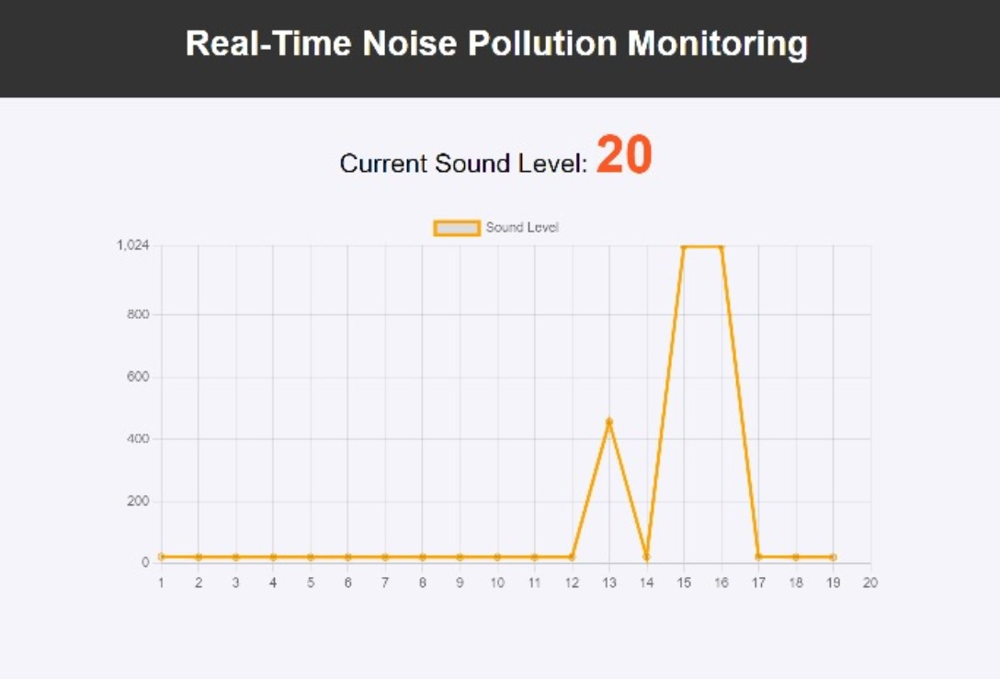
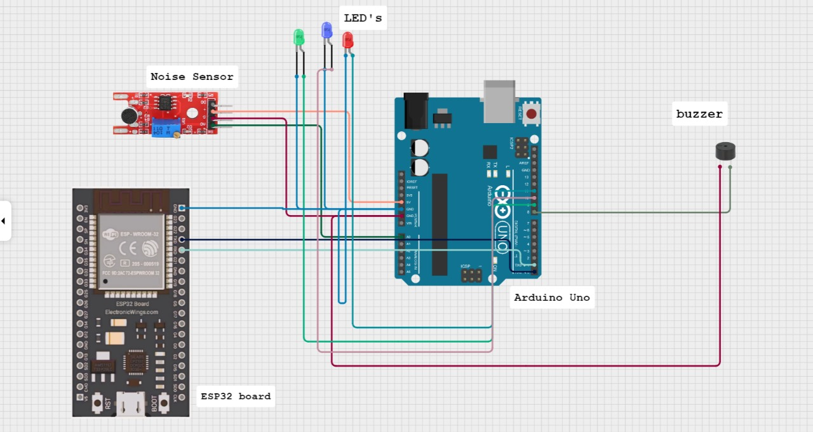
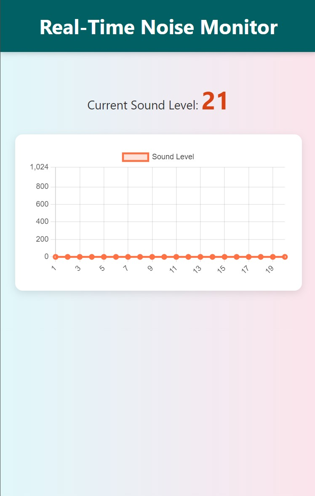

<!DOCTYPE html>
<html lang="en">
<head>
    <meta charset="UTF-8">
    <meta name="viewport" content="width=device-width, initial-scale=1.0">
</head>
<body>
    <header>
        <h1># Noise Pollution Monitoring System - Arduino</h1>
        
This is a project for Realtime detect and showcase Noise Pollution on a Monitoring System using Arduino.

    </header>
    <section>
      
        
        
    </section>
</body>
</html>
